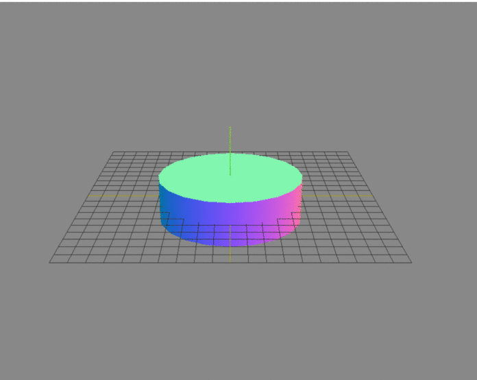
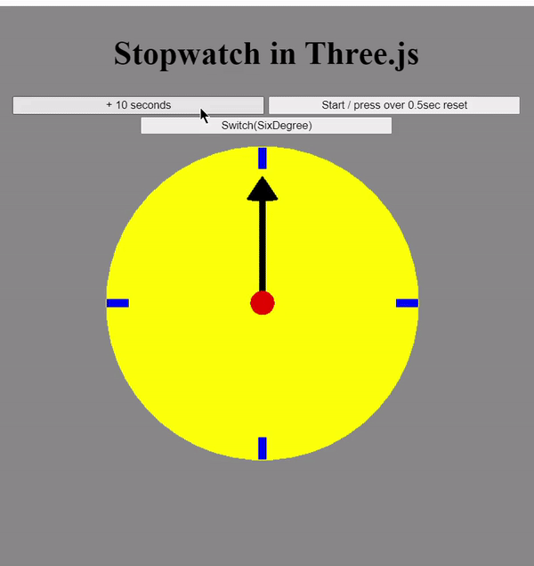
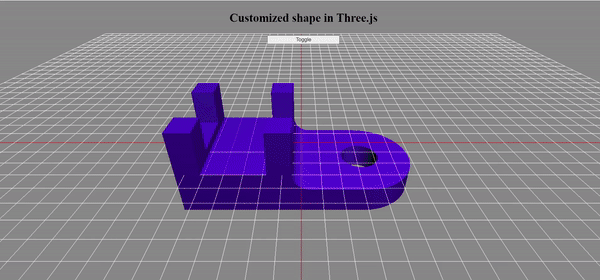
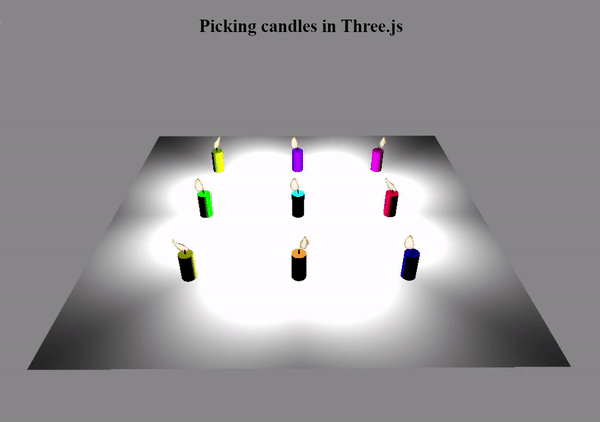

# TTU CSE Computer Graphics Homework 

- Click **[here](https://jerry762.github.io/TTU-CGhws/index.html)** go to my homework website.  
- Click **[here](https://github.com/jyunming-chen)** go to my teacher github for this course.  

## HW0 Cylinder:

## HW1 Stopwatch:

## HW2 Car Game:

## HW3 Customized Shape:

## HW4 Picking candles:

## HW5 Utah teapots:
(ver1)

(ver2)

